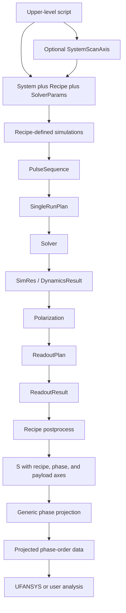

# Phase Cycling / Readout / Recipe 目标架构

> **Source of truth**
>
> 本文档是 QuDPy 目标 phase-cycling、readout 与 recipe 架构的权威说明。
> 后续实现、测试、example 和其他文档应以本文档为准。若当前源码与本文档
> 不一致，应把差异视为待迁移项，而不是修改本文档以迁就 legacy 行为。

本文档冻结术语、数学 convention、层级职责、目标数据流和已知迁移边界。
它不表示所有目标能力已经实现。当前实现状态与目标状态必须明确区分。

## Current implementation 与 Target architecture

当前源码已经具备可靠的 physical field、pulse sequence 和基础 phase-grid
表达能力，但尚未完成目标 workflow。特别是：

- canonical Fourier projection runtime 已使用固定含义的 `+i` projection；
  显式 `sign=-1` 仅作为发出 `DeprecationWarning` 的临时 legacy compatibility
  path 保留，不再定义 canonical `target_phase_vector` 语义；
- canonical `SingleRunPlan.execute()` 已止于 dynamics；独立 `ReadoutPlan` 已负责
  polarization-to-observable 计算。`ReadoutSpec`、`SingleRunResult.readout` 与
  `execute_with_legacy_readout()` 仅作为 temporary compatibility path 保留；
- canonical `project_phase_orders` 已是只接受 precomputed ndarray/named axes 的
  pure mathematical API，并支持一次请求多个 targets；
- heavy `PhaseCyclingPlan` 仍会生成 case、执行 legacy embedded readout，并只接受
  一个 target，但它只作为 compatibility orchestration 保留，不再是推荐路径；
- 旧 TA phase-cycling scaffold 仍在 recipe-specific postprocess 之前投影
  pump-probe readout；canonical M3+M4 TA 路径不再经过该 scaffold；
- 当前存在 `ProjectedReadoutBundle`、`TAPhaseCycledPumpProbeResult` 等目标中
  将废弃的 wrapper；
- 当前部分 API 使用 `absorption` 表示
  `omega * Im[P(omega) / E(omega)]`，它不是 detector intensity。

剩余项目均是已知 mismatch，不是本文档遗漏。Milestone 1-4 已分别迁移 Fourier
convention、readout ownership、TA recipe postprocess 与 pure projection。

## 核心原则

1. `System` 是 matter，`Field` 是 perturbation，`SolverParams` 是数值求解配置。
2. physical pulse count 不等于 phase-dimension count。
3. phase semantics 位于 pulse-sequence / recipe 层，不放进 raw physical Field。
4. Recipe 描述对一个给定 System 做什么实验；System scan 由上层脚本管理。
5. readout physics 与 solver execution 分离。
6. Recipe 先把多个 `ReadoutResult` 组合为实验 observable `S(...)`，然后才做
   generic phase projection。
7. generic phase-projection 层只处理预先计算好的 array-valued `S(...)`，不执行
   solver、readout 或 recipe postprocess。
8. 一份 `S(phi)` 必须可以投影多个 target phase-order vectors，而不重复昂贵计算。
9. 数据容器保持最简：NumPy ndarray、axis names、axis values 和必要 metadata。
10. 新架构优先于 backward compatibility；旧 API 在新 workflow 完成验证后再弃用。

## Terminology Table

| Term | Exact meaning | Owning layer | Current code representation | Target status |
| --- | --- | --- | --- | --- |
| System | Hamiltonian、basis、dipole、initial state、relaxation、dephasing 等 matter physics | System | `NLevelSystem`；底层仍会转换为 `NLevelPhysicalParams` | 保留概念；完善 adapter 属于独立任务 |
| SystemScanAxis | 在不同 System 间扫描的上层坐标，例如 PB、EIS、EID、temperature、model member | Upper-level orchestration | 当前主要由 scripts/examples 的循环表达；无必需 runtime class | 不进入 Recipe；不要求新增 class |
| Field | 进入 Hamiltonian 的 physical perturbation field | Field | `FieldPhyRoot` 及实现类 | 保留 |
| FieldPhyRoot | physical field 的抽象接口，使用物理时间与场强单位 | Field | `qudpy_sjh.utils.fields.lab_fields.FieldPhyRoot` | 保留 |
| CarrierEnvelopeField | 单 carrier、单 envelope 的 finite physical optical field | Field | `CarrierEnvelopeField` | 保留 |
| FieldPhySeries | 多个 physical fields 的线性和及 named subfields | Field | `FieldPhySeries` | 保留 |
| PulseSpec | physical field template 加 pulse timing/base phase/phase-tag metadata | PulseSequence | `PulseSpec` | 保留 |
| FieldGroupSpec | 多个 coherent physical pulses 的组合，可共享 group phase tag | PulseSequence | `FieldGroupSpec` | 保留当前名称 |
| PulseSequenceSpec | 一次 acquisition condition 的 pulse/group composition，可构造 concrete physical field | PulseSequence | `PulseSequenceSpec` | 保留 |
| SingleRunFieldPlan | 当前一次 concrete centers/phases 的 field-construction record | PulseSequence / execution boundary | `SingleRunFieldPlan` | 暂缓 rename/removal，后续重新评估 |
| SingleRunPlan | 对一个 concrete physical field 执行一次 dynamics simulation 的计划 | Execution | 当前还包含 `ReadoutSpec` 并在 `execute()` 中做 readout | 目标只负责 solver/dynamics execution |
| SimRes | 一次昂贵 dynamics simulation 的 canonical result | Execution | 当前 canonical class 是 `DynamicsResult` | 概念名可用 `SimRes`；当前实现继续用 `DynamicsResult` |
| SolverParams | time grid、tolerance、integrator/backend、numerical options、checkpoint settings | Execution | 当前高层 `NLevelPhysicalParams` 混合 System/Field/time grid；当前 `SolverParams` 是归一化内部摘要 | 目标概念已冻结；runtime 重构不在 M0 |
| Recipe | 对一个给定 System 定义实验 cases、coordinates、readout、postprocess 和 targets 的轻量 script/module | Recipe | TA 当前由多种 `TA*Plan/Spec` 类和 examples 表达 | 目标保持轻量，不要求 generic Recipe base class |
| Condition | 同一个 System 下不同 acquisition configuration，例如 pump on/off、probe on/off、chopper 或 LO state | Recipe | 当前 TA 使用 pump-probe/probe-only cases | 不代表不同 material/System |
| recipe coordinate | Recipe 自己定义的非 phase 实验坐标，例如 TA 的 `T` 或 2DES 的 `tau, T, t` | Recipe | 当前 TA delay fields/classes | 不创建 generic DelayAxis/ConditionAxis |
| phase dimension | 一个真正被 phase cycling 的、独立可控的 physical/mathematical phase degree of freedom | Recipe / phase domain | 由 pulse/group phase semantics 与 `PhaseGrid` 共同表达 | 正式术语 |
| phase_tag | 在代码中标识一个 phase dimension 的字符串 identifier | PulseSequence / phase domain | `PulseSpec.phase_tag`、`FieldGroupSpec.phase_tag`、`PhaseGrid.tags` | 正式代码术语 |
| PhaseGrid | phase tags 到 phase samples 的映射及其 Cartesian-product domain | Generic phase projection | `PhaseGrid` | 保留；扩展 uniform-grid convenience |
| phase order | observable 对某个 cycled phase dimension 的整数 Fourier/pathway order | Physics / Recipe | 当前 target coefficient | 正式物理术语 |
| phase-order vector | 所有 phase dimensions 的整数 order vector `m=(m_1,...,m_D)` | Physics / Recipe | `dict[str, int]` | 正式物理术语 |
| target_phase_vector | phase_tag 到 physical phase order 的代码映射 | Recipe / generic projection boundary | `target_phase_vector` | 保留名称；未来不暴露 configurable sign semantics |
| ReadoutField | coherent detection 使用的 field object/reference；可来自 interaction field，也可为 external LO | Readout | 当前 `readout_field_name` 只能选择 interaction field/其 subfield | 目标支持 named reference 或 external `FieldPhyRoot` |
| ReadoutPlan | 把 polarization 转换为 detector/readout observable 的 callable plan | Readout | 尚不存在；`ReadoutSpec` 只是配置并由外部函数执行 | 后续 behavioral redesign，不是简单 rename |
| ReadoutResult | 一次 readout 执行得到的 detector/readout data 与 axes/metadata | Readout | 当前近似对应 `SingleRunReadoutResult` | 后续独立于 `SingleRunResult` |
| Recipe.postprocess | 匹配、复用、broadcast、组合多个 `ReadoutResult`，形成每个 phase case 的 `S(...)` | Recipe | 当前 TA subtraction 分散在 TA helper/plan 中 | 目标为普通 Recipe 方法/函数，不建 `PostprocessPlan` |
| S(...) | recipe-specific postprocess 后、phase projection 前的 array-valued experimental observable | Recipe -> projection interface | 当前没有统一接口；可能直接投影 single-run readout | 正式接口；不限定为 polarization/intensity/absorption |
| phase cycling | 实验上改变一个或多个独立 phase variables 并 acquisition 的过程/概念 | Experiment / Recipe | 当前也被用于 heavy runner 名称 | 保留实验术语 |
| phase projection | 对已经计算好的 `S(phi)` 做离散 Fourier projection 得到 `S_m` | Generic phase projection | `fourier_project_phase_cases` 及 heavy `PhaseCyclingPlan` 的一部分 | 目标为 plain mathematical operation |
| payload axis | `S` 中既非 phase dimension、也非 system-scan axis 的普通数据维度，例如 omega 或 detection time | Recipe data / analysis | 当前由 readout arrays 与 `AxisMetadataSpec` 松散表达 | 用 `axis_names`/`axis_values` 明确绑定 |
| axis_names | 与 ndarray 每一维按位置一一对应的名称 tuple | Recipe data / generic projection | 当前没有统一 contract | 目标最小 contract |
| axis_values | axis name 到一维 coordinate values 的 mapping | Recipe data / generic projection | 当前 bundle 中有松散 `axes` dict | 目标最小 contract |
| UFANSYS / user analysis | FFT、plotting、alignment、selection、slicing 与后续 spectroscopy analysis | Analysis | 仓库外/用户脚本 | 不进入 Recipe 或 phase projection core |

## 容易混淆的术语

### Phase dimension 与 phase_tag

`phase dimension` 是物理和数学自由度；`phase_tag` 是标识该自由度的程序字符串。
例如 `phi_pump` 是 phase dimension，代码可以用 `phase_tag="pump"` 表示它。

当前 `PulseSpec` / `FieldGroupSpec` 还包含 `independent_phase`。它可能和
`phase_tag`、`PhaseGrid` 形成第二套 independence source of truth。M0 只记录
该风险；后续应决定是否清理，当前 runtime 不变。

### Physical pulse 与 phase dimension

```text
pulse1 phase = phi_pump
pulse2 phase = phi_pump
probe  phase = phi_probe
```

这是三个 physical pulses、两个 phase dimensions。多个 pulses 可以通过相同
phase tag 或 coherent `FieldGroupSpec` 共享一个被 cycle 的 phase。固定相位 pulse
不需要出现在 `PhaseGrid` 中；数学上它可视为 `N_j=1`，程序无需暴露该维度。

### Phase cycling 与 phase projection

- phase cycling：实验概念，包括设定 phase、进行 acquisition 和得到 phase cases；
- phase projection：对预先计算好的 `S(phi)` 进行数学 Fourier projection。

generic phase-projection 层不执行实验 case，也不执行 solver。

### Recipe coordinate、phase dimension 与 SystemScanAxis

- `T`、`tau`、`t` 是 recipe coordinates；
- `phi_pump`、`phi_probe` 是 phase dimensions；
- PB、EIS、EID、temperature、model member 是 SystemScanAxis coordinates。

Recipe 决定前两类的实验含义。System scan 完全由上层脚本管理。

### ReadoutResult 与 S

`ReadoutResult` 是一个 acquisition case 经 detector/readout physics 得到的结果。
`S` 是 Recipe 将一个或多个 `ReadoutResult` reuse、broadcast、combine 后形成的
实验 observable。只有 `S` 进入 generic phase projection。

## Adopted Fourier Convention

一条 pathway 的 phase 与空间因子定义为：

```text
exp[-i * sum_j(s_j * phi_laser,j)]
*
exp[+i * sum_j(s_j * k_j dot r)]
```

共享一个 pump phase 的多次 pump interaction 满足：

```text
m_pu = sum_j(s_pu,j)
```

一般 phase-order vector 为 `m=(m_1,...,m_D)`。采用的 projection convention 是：

```text
S_m = 1/product_j(N_j)
      * sum_over_phase_cases[
          S(phi_1,...,phi_D)
          * exp(+i * sum_j(m_j * phi_j))
        ]
```

uniform grid 为：

```text
phi_j,n = 2*pi*n/N_j
```

所以：

```text
S(phi) proportional to exp(-i*k*phi)
    -> target phase order m = k
```

`target_phase_vector` 直接表示 physical phase-order vector `m`。未来 public API
不应再把 configurable `sign` 当作 phase-order semantics 的组成部分。

> **Runtime status:** canonical projection helpers/specs 现已默认采用 `sign=+1`，
> 并在结果 metadata 中记录 `exp_plus_i_m_phi`、convention version `1` 以及
> physical phase-order target semantics。显式 `sign=-1` 暂时保留为 deprecated
> compatibility path；新代码、tests 和 examples 不应依赖它。

旧结果若只有 `S_0_1` 等 channel label，或只记录旧 `projection_sign` 而没有明确
convention/version，可能存在 phase-order 语义歧义。本项目不在 Milestone 1 自动
改写历史结果；解释旧数据时必须同时核对生成代码、sign 和 target definition。

## PhaseGrid 的数学边界

目标 `PhaseGrid` 支持：

- 任意 phase-dimension 数量 `D`；
- 每个维度不同的 `N_j`；
- 一个 `N` 应用于全部 dimensions 的 convenience input；
- 标准 uniform grids；
- 用户显式给定的 finite phase values。

“API 接受任意 phase values”不等于“equal-weight DFT 对任意 nonuniform samples
都是正确的 Fourier inversion”。当前及目标中的简单平均 projection 对标准完整
uniform grid 有明确离散正交性；对任意 nonuniform/不完整采样，通常需要 least
squares、quadrature weights 或其他 inversion 方法。未来 API 必须标明所采用的
数学假设，不能把输入 validation 误写成一般 nonuniform reconstruction 保证。

## Target Workflow



Recipe 可以直接由 script/module 定义。不要为了图中的逻辑节点创建
`ConditionPlan`、`RecipeCase`、`DelayAxis` 或 `PostprocessPlan` runtime classes。

## Layer Responsibility Table

| Layer | Owns | Does not own |
| --- | --- | --- |
| System | matter Hamiltonian、dipoles、initial state、relaxation、dephasing、system makers/adapters | Recipe、phase cycling、SystemScan orchestration |
| Field | carrier、envelope、amplitude、physical phase、field center 和 physical perturbation evaluation | pump/probe/LO experiment role、TA delay semantics |
| PulseSequence | experiment pulse composition、shared phase grouping、concrete pulse centers/phases 到 physical fields 的映射 | TA delay convention、Fourier targets、detector physics |
| Execution | one-run dynamics execution、solver invocation、checkpoint infrastructure、SimRes | detector/readout physics、Recipe postprocess、phase projection |
| Readout | target `ReadoutPlan`、polarization-to-detector transform、coherent detector physics、`ReadoutResult` | experimental condition subtraction、phase projection |
| Recipe | cases、Conditions、recipe coordinates、delay convention、选择/生成 ReadoutPlan、postprocess、requested target phase orders | SystemScanAxis、generic Fourier projection、solver internals |
| Generic phase projection | `PhaseGrid`、target phase orders、mathematical projection、future multi-target projection、minimal projection metadata | solver、readout、conditions、TA subtraction、Recipe reuse/broadcast |
| Upper-level scripts | SystemScanAxis、factorial system scans、对多个 Systems 重复 Recipe execution | Recipe 内部 coordinate semantics |
| UFANSYS / user analysis | FFT、plotting、alignment、selection、slicing、下游 spectroscopy analysis | solver/readout/Recipe execution orchestration |

## Readout Architecture

Milestone 2 后的 canonical 数据流是：

```text
SimRes -> polarization P -> ReadoutPlan.execute(P) -> ReadoutResult I
```

`qudpy_sjh.experiments.readout.ReadoutPlan` 是真正 executable 的 generic
abstraction，而不是 `ReadoutSpec` 的简单 rename。`PolarizationResult` 由保存的
`DynamicsResult` density trajectory、physical dipole matrix 和 number density
生成；同一份 polarization 可以执行任意多个便宜的 `ReadoutPlan`。第一版允许：

1. 引用 `PulseSequence` 中已经进入 Hamiltonian 的 named interaction field；
2. 直接持有一个不进入 Hamiltonian 的 external `FieldPhyRoot` 作为 guiding/LO。

当前 scope 中 readout/guiding field 不参与 phase cycling；暂不设计 phase-cycled LO。
`readout_field` 使用单一 union semantics：字符串引用 named interaction subfield，
`FieldPhyRoot` 表示 external/direct field，`None` 表示 total interaction field。
external field 只在 polarization time grid 上采样，不进入 Hamiltonian。

Readout behavior 至少应能够表达 full detector 与 weak-signal approximation：

```text
I_det(omega) = |E_readout(omega)|^2
             + 2 Re[E_readout*(omega) E_sig(omega)]
             + |E_sig(omega)|^2

E_sig proportional to i * omega * P_sig
```

忽略相应高阶项属于 weak-signal readout approximation，不属于 phase cycling。

canonical `mode="absorption_like"` 计算：

```text
absorption = omega * Im[P(omega) / E(omega)]
```

它是 susceptibility/absorption-like quantity，不是 full detector intensity。
canonical spectrum key 为 `absorption_like_response`；`absorption` 和
`omega_im_P_over_E` 暂时作为 numerical-parity aliases 保留。原有 relative-threshold
mask、positive-frequency selection、window、mean subtraction 和 zero padding 行为未改。

`mode="full"` 与 `mode="weak"` 共用同一个 coherent detector implementation：

```text
E_signal(omega) = i * emitted_field_scale * omega * P(omega)
```

其中 `emitted_field_scale` 是调用者提供的比例系数；runtime 不赋予它未经验证的
绝对强度解释。P 与 readout field 在同一 `time_fs` grid 上 FFT，不做 interpolation。

## Recipe、Condition 与 postprocess

Recipe 对一个给定 System 定义：

- 哪些 simulation/acquisition cases 必须执行；
- 每个 Condition 使用哪个 `PulseSequenceSpec`；
- recipe coordinates 如何映射为 concrete pulse centers；
- 选择或生成哪个 `ReadoutPlan`；
- 如何把 `ReadoutResult` 合成为 `S(...)`；
- 请求哪些 target phase-order vectors。

Condition 始终表示相同 System 下不同 acquisition configuration。PB、EIS、EID、
Hamiltonian、relaxation/dephasing、temperature、model member 或 disorder realization
的改变会产生不同 System，不是 Condition。

TA recipe 可利用自己知道的依赖关系避免重复昂贵模拟：

```text
I_on(T, phi_pump, phi_probe)
I_off(phi_probe)

S(T, phi_pump, phi_probe, omega)
  = [I_on(T, phi_pump, phi_probe, omega) - I_off(phi_probe, omega)]
    / I_off(phi_probe, omega)
```

`I_off` 不依赖 `T` 和 `phi_pump`，所以只执行必要 cases，再由
`Recipe.postprocess` broadcast。`I_off` 是 `deltaT/T` 定义中的 denominator；
`|E_readout|^2` 只可能在 weak-signal 推导中作为近似出现。

delay convention 同样属于 Recipe。PulseSequence 只接收 concrete centers，不知道
“TA positive delay”的含义。当前 TA 可以使用 `probe_center=0`、`pump_center=-T`；
其他 Recipe 可以采用不同 origin，只要明确 coordinate-to-center mapping。

Milestone 3 已由 `experiments/ta/ta_recipe_first.py` 中的轻量
`TAPrePCRecipe` 实现。当前 canonical TA 路径为：

```text
TAPrePCRecipe.build_dynamics_plans()
  -> condition-specific SingleRunPlan
  -> reusable SingleRunResult / SimRes
  -> TAPrePCRecipe.apply_readout(ReadoutPlan)
  -> ReadoutResult maps
  -> TAPrePCRecipe.postprocess(...)
  -> TAPrePCObservable S(T, phase dimensions, energy)
  -> future generic phase projection
```

`pump_on` 与 `pump_off` 各自拥有一个共享的 `PulseSequenceSpec` definition；
不同 `T` 只改变 concrete centers。`pump_off` dynamics key 为
`(probe_phase_index,)`，probe 未 cycle 时为 `()`，所以它不随 `T` 或不存在的
pump phase 重算。broadcast 只发生在 postprocess，不改变完整实验 grid 的定义。

detector-level canonical quantity 明确命名为 `delta_T_over_T`，同时保留
`difference_quantity="delta_I"`。分母有效性使用显式 absolute/relative threshold；
默认两者为零时只屏蔽 exact zero，所有无效点输出 NaN 并写入 metadata warning。
`delta_absorption_like = A_on - A_off` 仅作为数值兼容路径，不能解释为 detector
level `deltaT/T`。full 与 weak detector 仍完全由可替换的 `ReadoutPlan` 负责；
Recipe postprocess 对二者使用相同代数。

## S 与 Named Axes Contract

`S(phi_1,...,phi_D; other coordinates)` 是 Recipe postprocess 后、phase projection
前的正式接口。它可以是 scalar、real/complex ndarray、`S(omega)`、`S(T,omega)`
或任意高维 observable；generic projection 不解释其物理含义。

最低数据 contract 是：

```text
data: ndarray
axis_names: tuple[str, ...]
axis_values: mapping[str, ndarray]

len(axis_names) == data.ndim
len(axis_values[name]) == data.shape[axis_names.index(name)]
```

phase axes、recipe-coordinate axes 和 payload axes 都必须在 `axis_names` 中有明确
位置。projection 移除被投影的 phase axes，并保留剩余 axis names/values。
不引入 xarray，也不预先设计 heavy named-array hierarchy。

一份 `S(phi)` 必须原生支持多个 targets：昂贵的 solver、readout 和 Recipe
postprocess 各执行一次，只重复廉价 Fourier projection。

Milestone 4 的 canonical public API 是：

```python
project_phase_orders(
    data,
    *,
    axis_names,
    axis_values,
    phase_grid,
    targets,
    phase_axes=None,
    normalize=True,
)
```

默认 mapping 为 `phase_tag -> "phase:<tag>"`；只有使用其他 axis name 时才显式
提供 `phase_axes`。`PhaseGrid` 是 phase sampling 的 authoritative definition，
`axis_values` 中对应 phase axis 必须与它一致。返回普通 mapping：

```text
projected[target_name] -> ndarray
axis_names             -> remaining non-phase axes
axis_values            -> available remaining coordinates
targets                -> normalized complete physical order vectors
metadata               -> convention, normalization, grid, phase-axis mapping
```

实现先按 `PhaseGrid.tags` 找到并移动 phase axes，再 flatten Cartesian phase cases，
最后对每个 target 调用唯一权威的 `fourier_project_phase_cases` equal-weight core。
所有 phase axes 被移除，非 phase axes 的相对顺序保持不变。不同 phase tags 可使用
不同 `N_j`；`build_uniform_phase_grid(..., n_steps={tag: N_j})` 是 convenience API。

arbitrary finite phase values 仍可执行 equal-weight sum，但这不代表 general
nonuniform Fourier inversion、NUFFT 或 least-squares harmonic fitting。uniform N-step
grid 上 alias-equivalent orders `m` 与 `m+qN` 被允许并产生相同离散结果。

## Persistence

一次 Recipe execution 应保存：

1. 所有昂贵 `SimRes`；
2. final projected data；
3. recipe/execution metadata。

中间 `S(phi)` 不要求默认持久化，因为它可以从保存的 `SimRes` 经 readout 和
Recipe postprocess 重建。projected output 至少保存：

- target phase-order vector(s)；
- phase convention 及 convention/schema version；
- normalization；
- phase-grid definition；
- remaining `axis_names` 与 `axis_values`；
- 必要 provenance。

不要为了 persistence 建立大型 result hierarchy。

## Current Abstraction Status

| Current abstraction | Target status | Reason |
| --- | --- | --- |
| `PhaseGrid` | keep | 有独立 phase-domain semantics 与 validation |
| `project_phase_orders` | keep | M4 canonical pure named-axis, multiple-target projection API |
| heavy `PhaseCyclingPlan` | compatibility; target-to-remove | canonical path 不再需要；当前仍服务旧 examples/tests |
| `PhaseProjectionSpec` | compatibility; target-to-remove | canonical API 直接接受 data/axes/grid/targets/normalization |
| `PhaseCaseRecord` | move/remove from projection layer | execution provenance 属于 Recipe/execution manifest |
| heavy `PhaseCyclingResult` | simplify/remove if unnecessary | projected ndarray(s) 加最小 metadata 即可 |
| `AxisMetadataSpec` | candidate for simplification/removal | 当前与 ndarray dimension 绑定不足且依赖 SingleRun quantity extraction |
| `ProjectedReadoutBundle` | target-to-remove | projection 输入是 recipe observable，不一定是 readout |
| `TAPhaseCyclingSpec` | split into Recipe inputs | targets 属于 Recipe；projection math 属于 generic layer |
| `TAPhaseCycledPumpProbeResult` | target-to-remove | projected data 应保持 experiment-generic |
| TA projected-bundle builders | target-to-remove | 不再需要 readout-specific projection wrapper |
| `ReadoutPlan` / `ReadoutResult` | keep | M2 已实现独立 polarization-to-detector stage |
| `ReadoutSpec` | temporary compatibility | 只通过 adapter 翻译为 canonical `ReadoutPlan` |
| `SingleRunReadoutResult` | temporary alias | 当前 alias 到独立 `ReadoutResult`；名称清理留给 M5 |
| `SingleRunPlan.readout` | temporary compatibility | `execute()` 忽略它；旧 runner 显式调用 compatibility method |
| `SingleRunFieldPlan` | defer | 是否仍需单独存在要在 execution/readout 重构后评估 |
| `independent_phase` | defer | 可能形成 phase-independence 双 source of truth |
| System adapter initial-state/dephasing mapping | defer/separate issue | 问题真实但与 PC/Readout/Recipe 重构正交 |

Milestone 0 不删除、rename 或改变以上任何 runtime object。

## Planned Migration Boundaries

- **Milestone 1 completed:** canonical Fourier implementation 已迁移到固定含义的
  `+i` convention，并加入 convention/version metadata 与 synthetic harmonic tests。
- **Milestone 2 completed:** behavioral `ReadoutPlan` 已从 dynamics execution 抽离，
  支持 interaction-field reference、external field、absorption-like、full 与 weak modes。
- **Milestone 3 completed:** `TAPrePCRecipe` 先复用 dynamics，再执行独立 readout，
  最后由 `postprocess` 构造 named-axis pre-PC `S(...)`；pump-off 只按真实 probe
  phase dependency 执行并在 `T`/pump-phase 方向 broadcast。
- **Milestone 4 completed:** `project_phase_orders` 已实现 pure named-axis projection、
  unequal `N_j` 与 multiple targets；canonical path 不再依赖 heavy `PhaseCyclingPlan`。
- **Milestone 5 deferred:** projected/result wrappers 与 persistence cleanup 尚未开始。
- **Milestone 6 deferred:** TA phase-step scientific convergence 与 legacy cleanup 尚未开始。
- **Later cleanup milestone:** 数值/物理验证和 example/test migration 后，才标记
  heavy runner、bundle 和 TA projected wrappers deprecated，随后删除。
- **Separate system milestone:** 修复 `NLevelSystem.initial_state` 与 transition
  dephasing 到 solver execution 的完整映射。

## Explicit Non-goals

当前架构不要求：

- generic `ConditionPlan`、`RecipeCase`、`DelayAxis` 或 `PostprocessPlan`；
- xarray 或 heavy named-array class；
- phase-cycled readout/LO field；
- 把 SystemScanAxis 放入 Recipe；
- 在 generic phase projection 中执行 solver、readout、subtraction 或 TA logic；
- 在本次 terminology freeze 中修改任何 runtime behavior。
